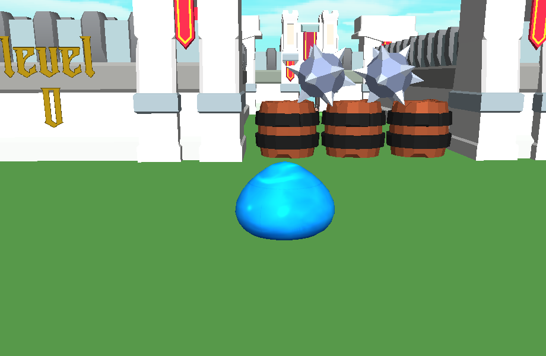
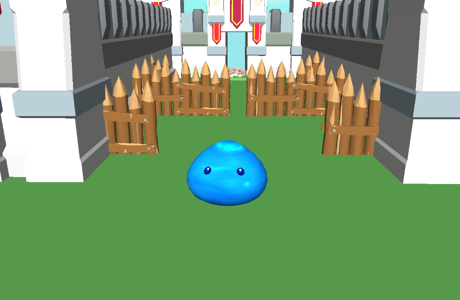
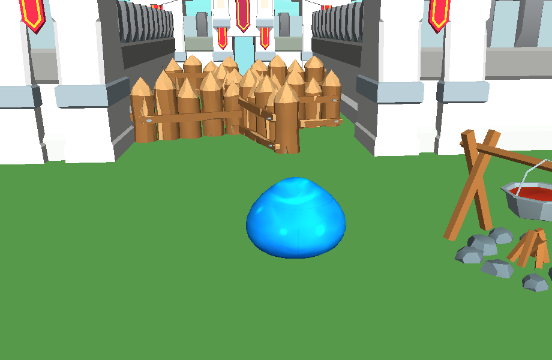
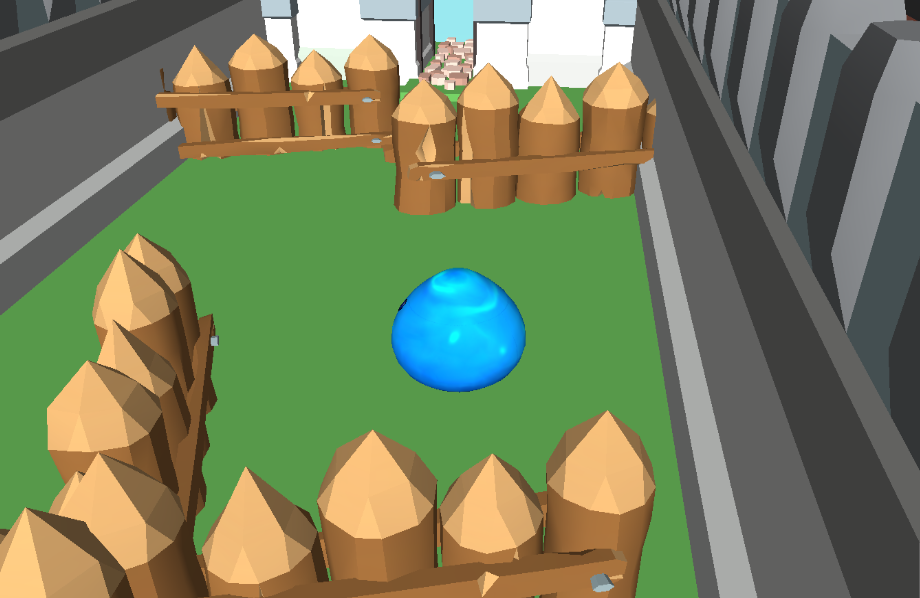
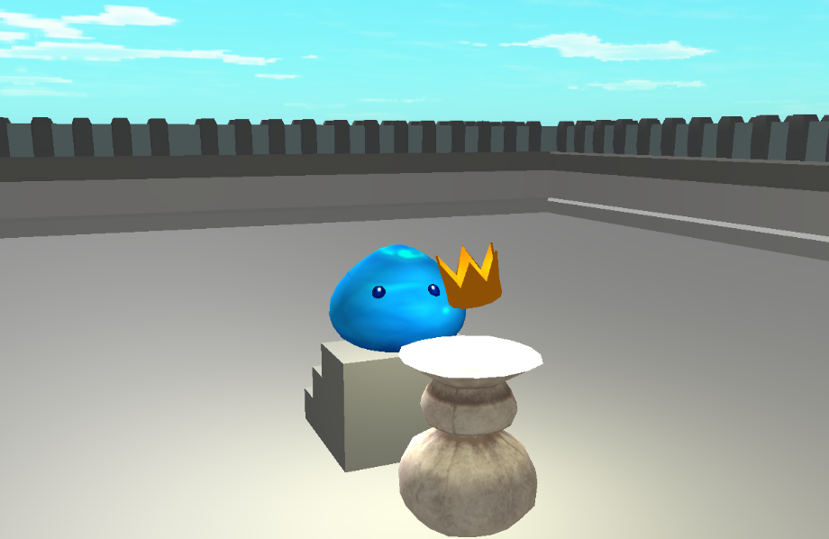

# Slime Breakthrough

Welcome to the Slime Breakthrough demo, a small puzzle game where your goal is to get your crown back from a castle guarded by really basic parkour.\
This game is provided as an example project on how to use LushEngine v1. All the resources are included, as well as a build of the game.\
Please note that the game is running on an outdated version of the engine. Bugs are to be expected.

_NB:_ The game is only available on Linux.

## How to Play

1. **Download the Game:** Download the files or clone this repository.
2. **Launch the Game:** Double-click the executable file to start the game.
3. **Start the game:** Press space to start the first level. Please click on the window to make sure it is focused. (fixed in later version of the engine)
4. **Play the Game:** Your cursor is hidden. Esc to quit the game, use your mouse to look around, and ZQSD to control the slime.
5. **Complete Challenges:** Avoid hazards and reach the exit to progress to the next level and get your crown back.
6. **Enjoy!**

## Feedback and Support

If you encounter any issues, have suggestions for improvements, or simply want to share your thoughts, please don't hesitate to reach out to me.

- **Contact:** Create an issue on this repository.
- **Community:** Join the Discord server.

## Credits

- **Game Design:** PierreMauger
- **Programming:** PierreMauger
- **Artwork:** Free assets
- **Music and Sound Effects:** No one lol

## Screenshots

